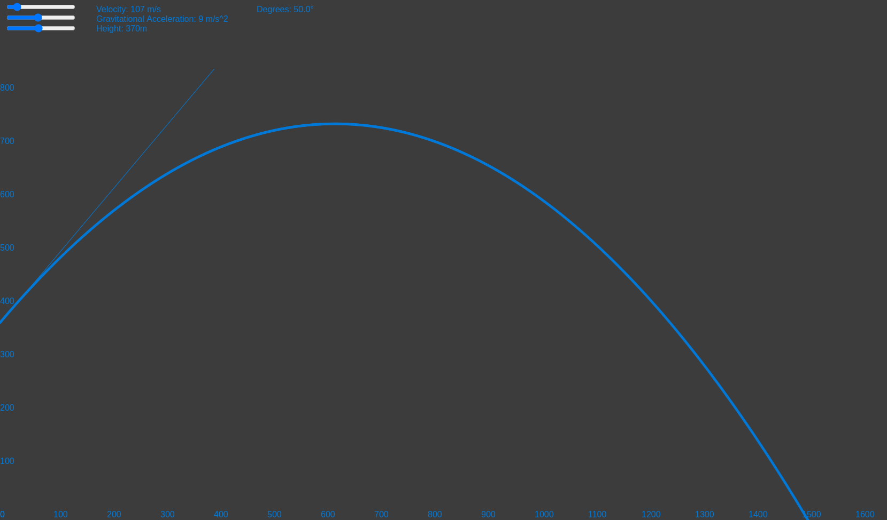

# Wurf

The site is hosted on GitHub Pages and can be found [here](https://sebastian-heinzenburger.github.io/Wurf/schraeg/)

This program calculates the *ballistic trajectory* with variable:
- Velocity
- Gravitational Acceleration
- Initial Height
- Initial launch angle

The mouse pointer is used to set the launch angle θ, so try moving it around to see how it affects the parabola!

